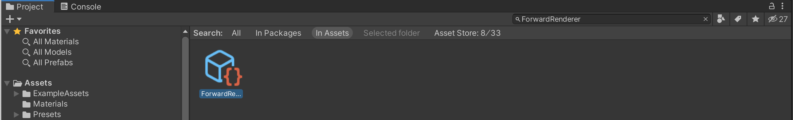

# Drone Pose Estimation And Navigation Tutorial: Part 1

In this first part of the tutorial, we will start by downloading and installing the Unity Editor. We will install our project's dependencie(s): the Perception package. We will then use a set of provided prefabs to easily prepare a simulated environment containing a drone, a wall, a target and a few distractor objects. 


**Table of Contents**
  - [Requirements](#reqs)
  - [Create a New Project](#step-1)
  - [Download the Perception Packages](#step-2)
  - [Set Up the Ground Truth Renderer Feature](#step-3)
  - [Set Up the Scene](#step-4)

---

### <a name="reqs">Requirements</a>

To follow this tutorial you need to **clone** this repository even if you want to create your Unity project from scratch. 

1. Open a terminal and navigate to the folder where you want to host the repository. 
```bash
git clone git@github.com:Unity-Technologies/drone-pose-estimation-navigation.git
```

2. [Install Unity `2020.2.*`.](install_unity.md) or a later version of it. 


### <a name="step-1">Create a New Project</a> 
When you first run Unity, you will be asked to open an existing project, or create a new one.

1. Open Unity and create a new project using the **Universal Render Pipeline**. Name your new project _**Drone Pose Estimation Tutorial**_, and specify a desired location as shown below.

<p align="center">

</p>


### <a name="step-2">Download the Perception Package</a>

Once your new project is created and loaded, you will be presented with the Unity Editor interface. From this point on, whenever we refer to the "editor", we mean the Unity Editor.

#### How to install packages
We will need to download and install the Perception package. In general, packages can be installed in Unity with the following steps:

- From the top menu bar, open _**Window**_ -> _**Package Manager**_. As the name suggests, the _**Package Manager**_ is where you can download new packages, update or remove existing ones, and access a variety of information and additional actions for each package.

- Click on the _**+**_ sign at the top-left corner of the _**Package Manager**_ window and then choose the option _**Add package from git URL...**_. 

- Enter the package address and click _**Add**_. 
  
It can take a few minutes for the manager to download and import packages.

<p align="center">

</p>


#### Install Dependencies
Install the following packages with the provided git URL:

1. [Perception package](https://github.com/Unity-Technologies/com.unity.perception) - `com.unity.perception@0.8.0-preview.3`
    * This will help us collect training data for our machine learning model. 


### <a name="step-3">Set Up Ground Truth Renderer Feature</a>

The ***Hierarchy***, ***Scene***, ***Game***, ***Inspector***, ***Project***, and ***Console*** windows of the Unity Editor, as well as the ***Play/Pause/Step*** toolbar have been highlighted below for reference, based on the default layout. Custom Unity Editor layouts may vary slightly. A top menu bar option is available to re-open any of these windows: ***Window > General***.

<p align="center">

</p>


The Perception package relies on a "Ground Truth Renderer Feature" to output labeled images as training data. Follow the steps below to add this component to your rendering settings:

1. The _**Project**_ tab contains a search bar; use it to find the file named `ForwardRenderer`, and click on the file named `ForwardRenderer.asset` as shown below:

<p align="center">

</p>

2. Click on the found file to select it. Then, from the _**Inspector**_ tab of the editor, click on the _**Add Renderer Feature**_ button, and select _**Ground Truth Renderer Feature**_ from the dropdown menu:

<p align="center">

</p>


### <a name="step-4">Set Up the Scene</a>

#### The Scene
Simply put in Unity, a Scene contains any object that exists in the world. This world can be a game, or in this case, a data-collection-oriented simulation. Every new project contains a Scene named `SampleScene`, which is automatically opened when the project is created. This Scene comes with several objects and settings that we do not need, so let's create a new one.

1. In the _**Project**_ tab, right-click on the `Assets/Scenes` folder and click _**Create -> Scene**_. Name this new Scene `TutorialDronePoseEstimation` and double-click on it to open it. 

The _**Hierarchy**_ tab of the editor displays all the Scenes currently loaded, and all the objects currently present in each loaded Scene, as shown below:
<p align="center">

</p>

As seen above, the new Scene already contains a camera (`Main Camera`) and a light (`Directional Light`). We will now modify the camera's field of view and position to prepare it for the tutorial.

2. Still in the _**Inspector**_ tab of the `Main Camera`, modify the camera's `Position` and `Rotation` to match the values shown below. This orients the camera so that it will have a good view of the objects we are about to add to the scene.   

<p align="center">

</p>

3. Click on `Directional Light` and in the _**Inspector**_ tab, modify the light's `Position` and `Rotation` to match the screenshot below. 

<p align="center">

</p>

#### Adding Tutorial Files
Now it is time to add some more objects to our scene. Before doing so, we need to import some folders containing the required assets. 

4. Download [TutorialAssets.zip](https://github.com/Unity-Technologies/drone-pose-estimation-navigation/releases/download/v0.0.1/TutorialAssets.zip), and unzip it. It should contain the following subfolders: `Materials`, `Prefabs`, `RosMessages`, `Scripts`, `URDFs`.

5. Drag and Drop the `TutorialAssets` folder from your operating system's file explorer onto the `Assets` folder in the _**Project**_ tab of the editor. 

Your `Assets` folder should like this: 

<p align="center">

</p>

#### Using Prefabs
Unity’s [Prefab](https://docs.unity3d.com/2020.2/Documentation/Manual/Prefabs.html) system allows you to create, configure, and store a GameObject complete with all its components, property values, and child GameObjects as a reusable Unity Asset. It is a convenient way to store complex objects. 

A Prefab is just a file, and you can easily create an instance of the object in the scene from a Prefab by dragging it into the _**Hierarchy**_ tab.

For your convenience, we have provided Prefabs for most of the components of the scene (the cube, goal, table, and floor).

6. In the _**Project**_ tab, go to `Assets/TutorialAssets/Prefabs/Part1` and drag and drop the `Cube` Prefab into the _**Hierarchy**_ tab.

7. Repeat the above action with the `Goal`, `Table` and `Floor` Prefabs. 


<p align="center">

</p>

>Note: If you encounter issues with the materials of the imported Prefabs, check the [Troubleshooting Guide](troubleshooting.md) for potential solutions.


### Proceed to [Part 2](./2_set_up_the_scene_for_data_collection.md).
