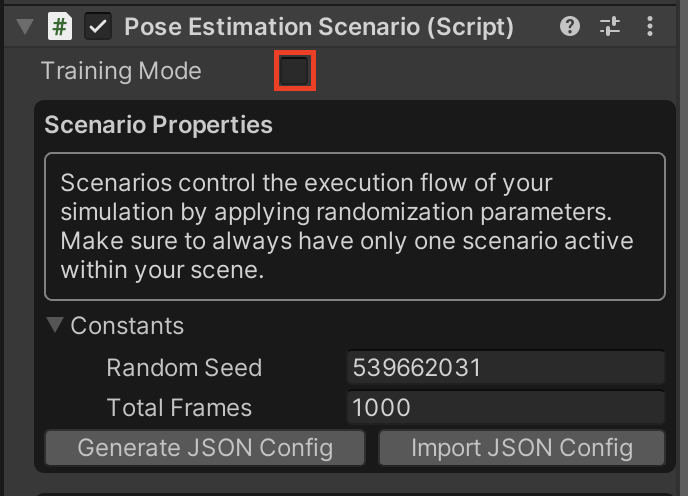

# Part 4: Inference & Navigation

In [Part 1](1_create_unity_project_with_unity_packages.md) of the tutorial, we learned how to create our Scene in Unity Editor.

In [Part 2](2_set_up_the_scene_for_data_collection.md) of the tutorial, we learned:
* How to equip the camera for the data collection
* How to set up labelling and label configurations
* How to create your own Randomizer 
* How to add our custom Randomizer 

In [Part 3](3_data_collection_and_model_training.md) of the tutorial we learned:
* How to collect large dataset of RGB images and the corresponding poses of the target and the drone. 
* How to use that data to train machine learning model to predict the target's position and drone's position from images taken by our camera.

In this part, we will setup the grpc connection in order to communicate between our python model and our Unity environment.

Steps included in this part of the tutorial:

**Table of Contents**
  - [Setup](#setup)
  - [Add the Pose Estimation Model](#step-2)
  - Inference
    - [gRPC connection](#step-3.1)
    - [Unity Barracuda](#step-3.2)
  - [Put It All Together](#step-4)

---

### <a name="setup">Set up</a>

### <a name="step-2">Add the Pose Estimation Model</a>

Here you have two options for the model:

#### Option A: Use Our Pre-trained Model

1. To save time, you may use the model we have trained. Download this [UR3_single_cube_model.tar](https://github.com/Unity-Technologies/Robotics-Object-Pose-Estimation/releases/download/v0.0.1/UR3_single_cube_model.tar) file, which contains the pre-trained model weights.

#### Option B: Use Your Own Model

2. You can also use the model you have trained in [Part 3](3_data_collection_and_model_training.md). However, be sure to rename your model to `UR3_single_cube_model.tar` as the script that will call the model is expecting this name.


**Inference**

### <a name="step-3.1">gRPC connection</a>

1. Navigate to folder `drone-pose-estimation-navigation/inference`
2. Based on [Add the Pose Estimation Model](#step-2) we choose the model to be used, and run a python process that exposes a service API over gRPC using:
```shell
python server.py
```
3. Open the Unity project as instructed in  [Part 2](./2_set_up_the_scene_for_data_collection.md).
4. Select the `SimulationScenario` GameObject, and uncheck `Training` flag in `Pose Estimation Scenario` in the inspector as shown below:

<p align="center">
    
</p>
5. Hit play. This will start the player in inference mode. There are
three buttons in this mode:


* New Environment: Creates a new environments based off the Randomizers
* Start Pose Estimation: This will send a screenshot of the current scene to the gRPC API exposed in step #2, and 
will get back a prediction of the drone & target translation.
* Start Navigate: The predicted translation of the target is then used by the Navmesh module to navigate to the target.


### <a name="step-3.1">Unity Barracuda</a>