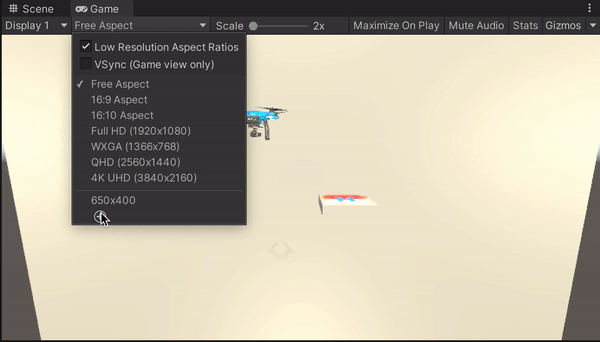

# Pick-and-Place with Object Pose Estimation: Quick Demo

⌛ _Expected completion time: 25-35 minutes_

If you just want to run the completed project, this section can help you get up and running quickly. Here, we provide a pre-trained pose estimation model for you to use, and assume a Docker workflow. By the end of this quick demo, you will be able to perform pose estimation and navigation in Unity with machine learning-based perception. To learn how to build something like this from scratch, see our [full tutorial](1_create_unity_project_with_unity_packages.md).

**Table of Contents**
- [Prerequisites](#Prerequisites)
- [Add the Pose Estimation Model](#add-the-pose-estimation-model)
- [Set Up the Unity Side](#set-up-the-unity-side)
- [Put It All Together](#putting-it-together)

---

## Prerequisites

You will first need to **clone** this repository. 

1. Open a new terminal and set yourself where you want to host the repository and run the following command: 
```bash
git clone git@github.com:Unity-Technologies/drone-pose-estimation-navigation.git
```

2. [Install Unity `2020.3.*`.](install_unity.md)

## <a name='setup'>Setup</a>

1. Open the completed project. In the Unity Hub, click the `Add` button, and select `drone-pose-estimation-navigation/PoseEstimationNavigationDemoProject` from inside the file location where you cloned the repo. 

2. Open the scene. Go to `Assets/Scenes` and double click on `TutorialDronePoseEstimationNagivation`. 

3. We now need to set the size of the images used. In the ***Game*** view, click on the dropdown menu in front of `Display 1`. Then, click **+** to create a new preset. Make sure `Type` is set to `Fixed Resolution`. Set `Width` to `650` and `Height` to `400`. The gif below depicts these actions.

<p align="center">

</p>

## Add the Pose Estimation Model

1. Download the [pose estimation model](https://github.com/Unity-Technologies/drone-pose-estimation-navigation/releases/download/v0.6.0/Drone_pose_estimation_model.tar) we have trained.

2. Go inside the `inference` folder and copy the `Drone_pose_estimation_model.tar` file you just downloaded into this folder.


## Set Up the Unity Side

1. ...

Congrats! You did it!

If you'd now like to follow the full tutorial to learn how to build the pose estimation and navigation simulation from scratch, proceed to [Part 1](1_create_unity_project_with_unity_packages.md)

