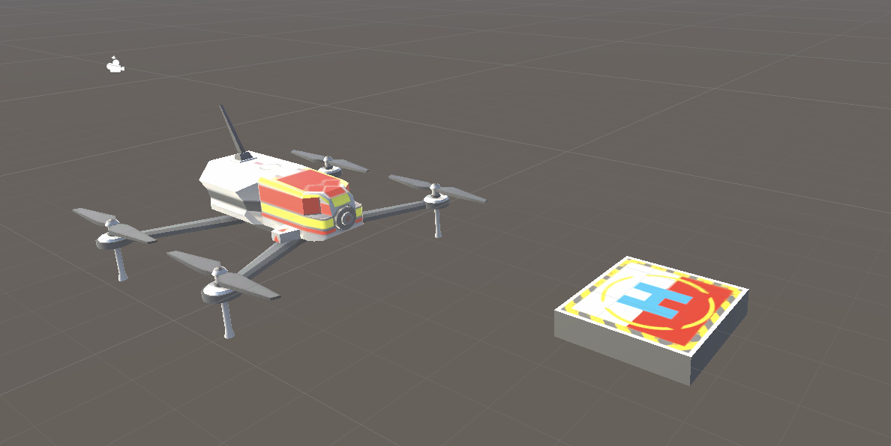

# AI Hackweek 2021 - Drone Pose Estimation and Navigation

The project relies on Unity version `2020.2.7f1`.


This project is on multi-object pose estimation and navigation, for a drone and a target landing pad. To do so, we used Unity’s perception package, in order to capture randomly generated synthetic data, which can be used to train a multi-object pose estimation model. This model can then be used to estimate the pose of our drone and target objects in a newly generated scene that was never seen before. The estimated pose, in other words, the position and orientation of the objects, allow us to perform path planning, navigation, and obstacle avoidance, for landing the drone onto the target.


> Note: This project has been developed with Python 3 and relies on Unity version `2020.2.7f1`.

### Cloning the repository
Prior to cloning via command line, ensure that you have [Git LFS](https://docs.github.com/en/github/managing-large-files/installing-git-large-file-storage) installed, otherwise large files will not download correclty. Then open a new terminal and set yourself where you want to host the repository and run the following command: 
```bash
git clone git@github.com:Unity-Technologies/ai-hw21-drone-pose-estimation-navigation.git
```


**Table of Contents**
- [Part 1: Setting up Unity scene for data collection](#link-part-1)
- [Part 2: Data Collection and Model Training](#link-part-2)
- [Part 3: GRPC connection](#link-part-3)
- [Part 4: Navigation with NavMesh](#link-part-4)
  
---

### <a name="link-part-1">Part 1: Setting up Unity scene for data collection</a>


 
 This part focuses on setting up the scene for data collection using the Unity Computer Vision [Perception Package](https://github.com/Unity-Technologies/com.unity.perception).We use the Perception Package [Randomizers](https://github.com/Unity-Technologies/com.unity.perception/blob/master/com.unity.perception/Documentation~/Randomization/Index.md) to randomize aspects of the scene in order to create variety in the training data. 

We have created our own randomizers: 
- randomization of the number of distractor objects: randomly generates objects in the scene. Objects are picked among a library. 
- randomization of the position of objects: the available positions are within a volume and we made sure that for the drone and the landing target they always appear in the top 2/3 of the screen and in the bottom 1/3 of the screen respectively. 
- randomization of the orientation: randomly rotates the landing target and the drone along the y-axis and randomly rotates all the distractor objects along x, y and z-axis. 
- ...


---

### <a name="link-part-2">Part 2: Data Collection and Model Training</a> 


This part includes running data collection with the Perception Package, and using that data to train a deep learning model. The training step can take some time. If you'd like, you can skip that step by using our pre-trained model.

To measure the success of grasping in simulation using our pre-trained model for pose estimation, we did 100 trials and got the following results:

|                  | Success | Failures | Percent Success |
|:----------------:|:-------:|:--------:|:---------------:|

If you want to have more information on how the model works and how to train your own, go [here](Model/README.md)

---
### <a name="link-part-3">Part 3: GRPC connection</a> 


---

### <a name="link-part-4">Part 4: Navigation with NavMesh</a> 


---
