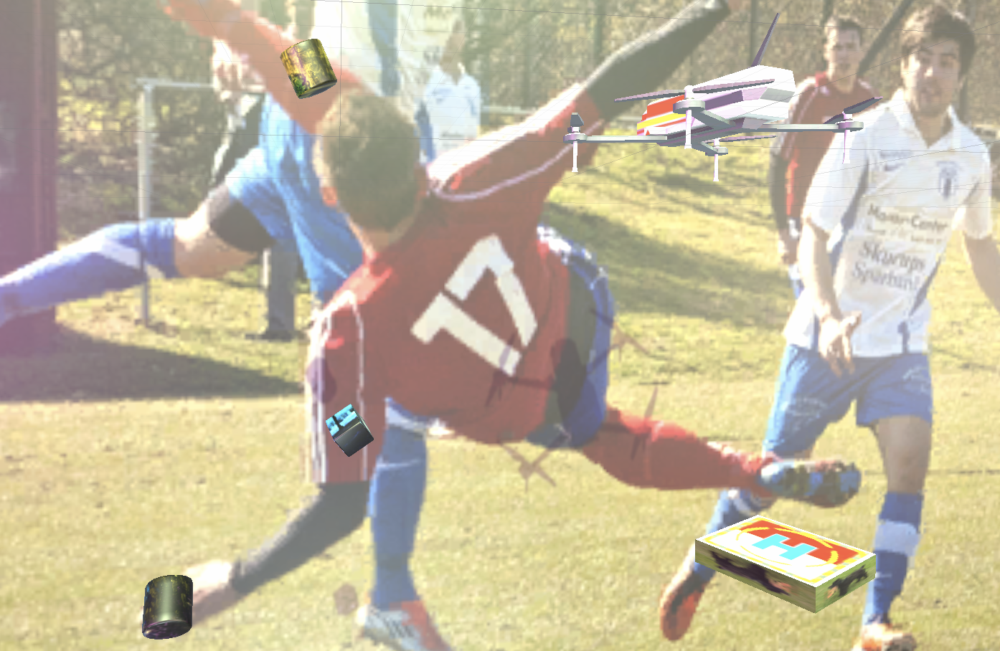

# Drone pose estimation and Navigation with Unity


<!--  -->


> Note: This project has been developed with Python 3 and relies on Unity version `2020.3.7f1` and [Unity Perception SDK](https://github.com/Unity-Technologies/com.unity.perception) `0.8.0-preview.2`.

This project is on multi-object pose estimation and navigation, for a drone and a target landing pad. To do so, we used Unity’s perception package, in order to capture randomly generated synthetic data, which can be used to train a multi-object pose estimation model. This model can then be used to estimate the pose of our drone and target objects in a newly generated scene that was never seen before. The estimated position of the objects, allow us to perform path planning, navigation, and obstacle avoidance, for landing the drone onto the target.


### Cloning the repository
Open a new terminal and set yourself where you want to host the repository and run the following command: 
```bash
git clone git@github.com:Unity-Technologies/drone-pose-estimation-navigation.git
```


**Table of Contents**
- [Part 1: Create the Unity Project with Perception package](Documentation/1_create_unity_project_with_unity_packages.md)
- [Part 2: Setup the Unity Scene for Data Collection](Documentation/2_set_up_the_scene_for_data_collection.md)
- [Part 3: Data Collection and Model Training](Documentation/3_data_collection_and_model_training.md)
- [Part 4: Inference and Navigation](Documentation/4_inference_and_navigation.md)

---
### <a name="link-part-1">[Part 1: Setting up Unity scene for data collection](Documentation/1_create_unity_project_with_unity_packages.md)</a>


 
 This part focuses on setting up the scene for data collection using the Unity Computer Vision [Perception Package](https://github.com/Unity-Technologies/com.unity.perception).We use the Perception Package [Randomizers](https://github.com/Unity-Technologies/com.unity.perception/blob/master/com.unity.perception/Documentation~/Randomization/Index.md) to randomize aspects of the scene in order to create variety in the training data. 

---

### <a name="link-part-2">[Part 2: Setting up Unity scene for data collection](Documentation/2_set_up_the_scene_for_data_collection.md)</a>


 
 This part focuses on setting up the scene for data collection using the Unity Computer Vision [Perception Package](https://github.com/Unity-Technologies/com.unity.perception).We use the Perception Package [Randomizers](https://github.com/Unity-Technologies/com.unity.perception/blob/master/com.unity.perception/Documentation~/Randomization/Index.md) to randomize aspects of the scene in order to create variety in the training data. 

---

### <a name="link-part-3">[Part 3: Data Collection and Model Training](Documentation/3_data_collection_and_model_training.md)</a> 

<!--  -->


This part includes running data collection with the Perception Package, and using that data to train a deep learning model. The training step can take some time. If you'd like, you can skip that step by using our pre-trained model.


If you want to have more information on how the model works and how to train your own, go [here](model/README.md).

---

### <a name="link-part-5">[Part 4: Navigation and Inference](Documentation/4_inference_and_navigation.md)</a> 

# TODO: @Priyesh - add image
<!--  -->

For inference the Unity scene connects to an external python process which that serves the trained model input/output.
gRPC is a modern high performant Remote Procedure Call framework that can run in any environment. More information on the gPRC can be found [here](https://grpc.io/docs/what-is-grpc/introduction).

After getting the prediction we use Unity's [Navigation and Pathfinding](https://docs.unity3d.com/Manual/Navigation.html) system that allows intelligent navigation of characters in the game world. This system uses navigation meshes that are automatically created from the scene geometry, called [NavMesh](https://docs.unity3d.com/ScriptReference/AI.NavMesh.html).

---
