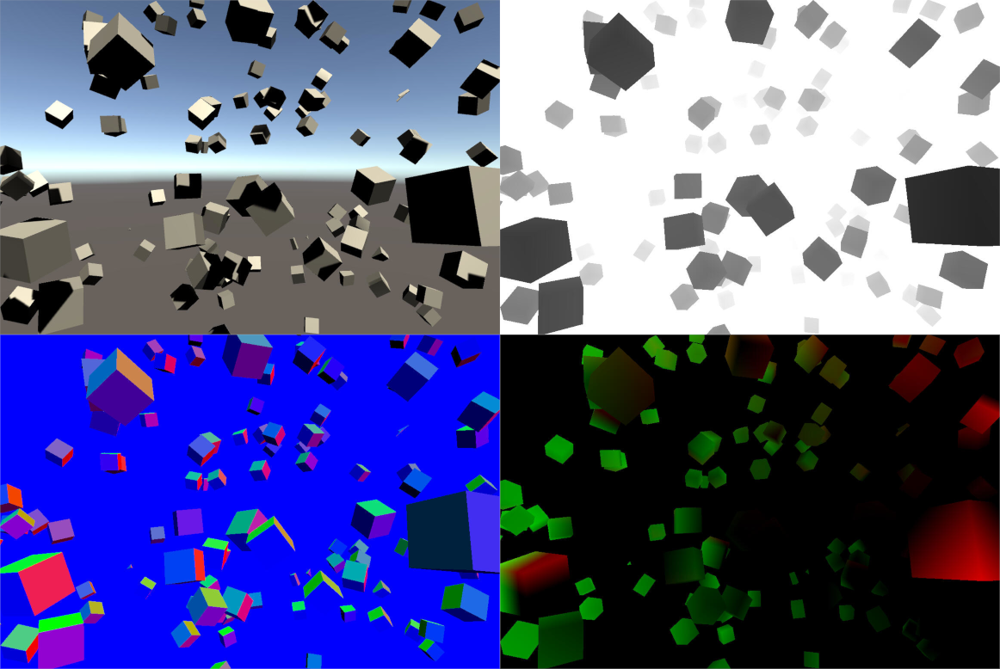

# com.unity.simulation.capture

Unity Simulation Capture SDK to perform Data Capture.

|Render Pipeline |RGB|Depth|Normals|Motion Vectors|
|-|--------|-|-|-|
|**Builtin**|Yes|Yes|Yes|Yes|
|**Universal**|Yes|Yes|Yes|N/A|
|**High Definition**|Yes|Yes|Yes|Yes|
